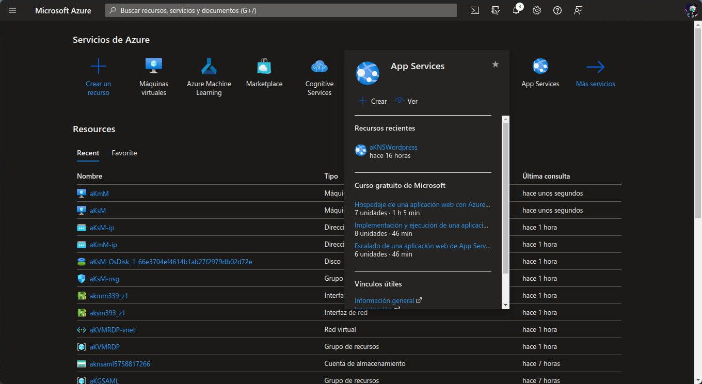
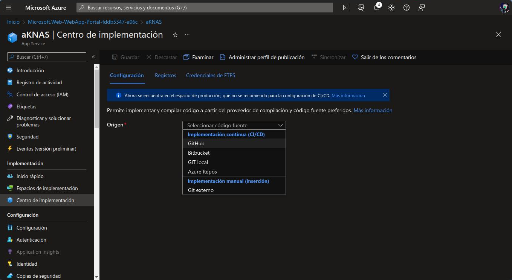
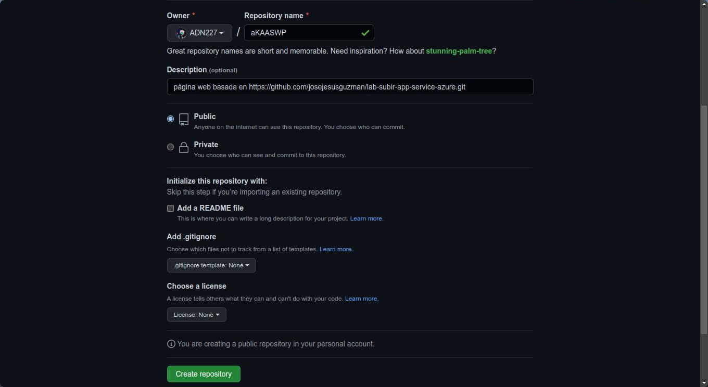
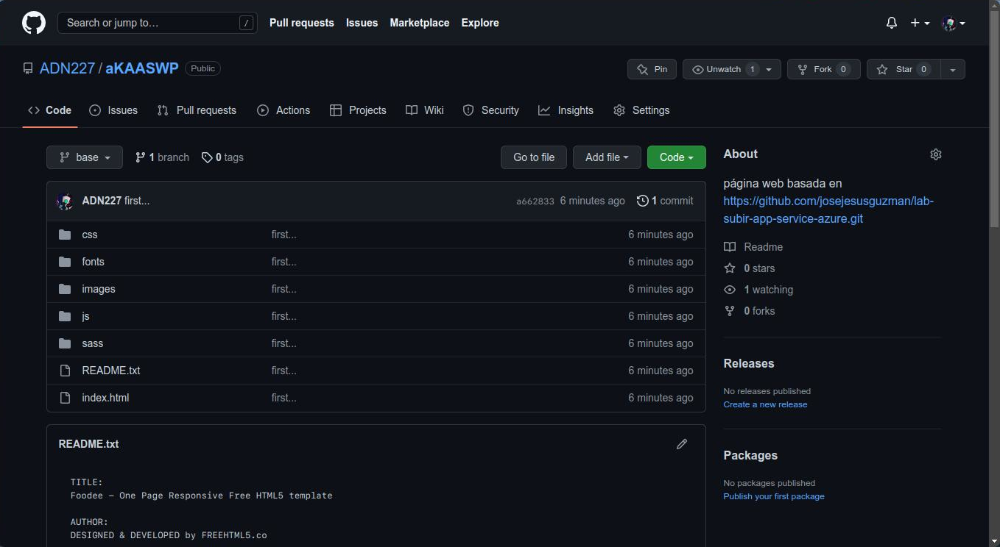
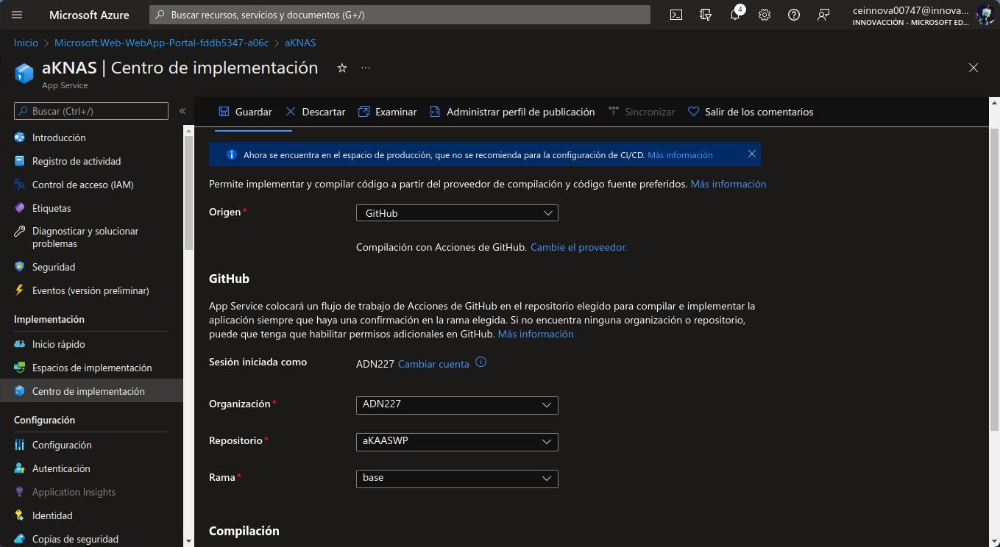
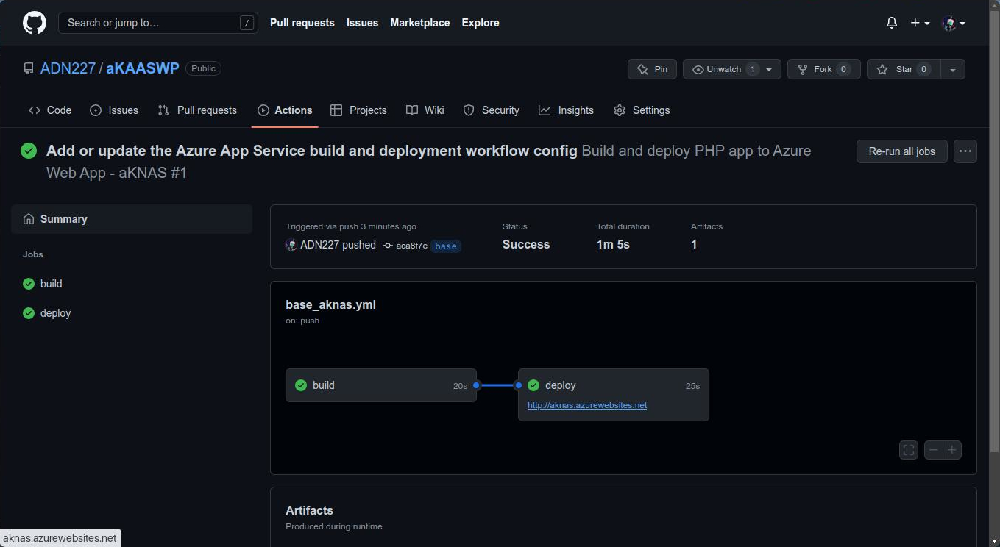

# Página web con Azure App Services

Recordar que Azure App Services es una herramienta que te permite crear una aplicación web en Azure y es necesario tener una cuenta de Azure.

Desde el [portal de Azure](https://portal.azure.com) es necesario seleccionar la opción **App Service** y llenar los formularios:

## Datos básicos
- Suscripción
- Grupo de recursos
- Nombre de la aplicación web
- Pila del entorno (en este caso PHP)
- SKU y tamaño (en este caso la opción **Gratis F1**)

## Revisar y crear 
Si todo esta bien podemos acceder a nuestro recurso de App Service. Dentro de **Implementación > Centro de implementación** seleccionaremos GitHub como el origen de nuestra aplicación.

## Crear repositorio
En [GitHub](https://github.com) creamos un repositorio público. 

En nuestra máquina de trabajo creamos los archivos de nuestra aplicación web, en este caso los archivos de nuestra aplicación web estan basados en el [Ejemplo de Azure App Services](https://github.com/josejesusguzman/lab-subir-app-service-azure).

Después de crear de subir nuestro trabajo al repositorio, en el recurso de App Service seleccionaremos el repositorio que acabamos de crear y lo guardamos.

Desde la sección **Actions** de GitHub podemos ver el estado de nuestro trabajo. Cuando el deploy termina, podemos ver el link de nuestra aplicación web. 
